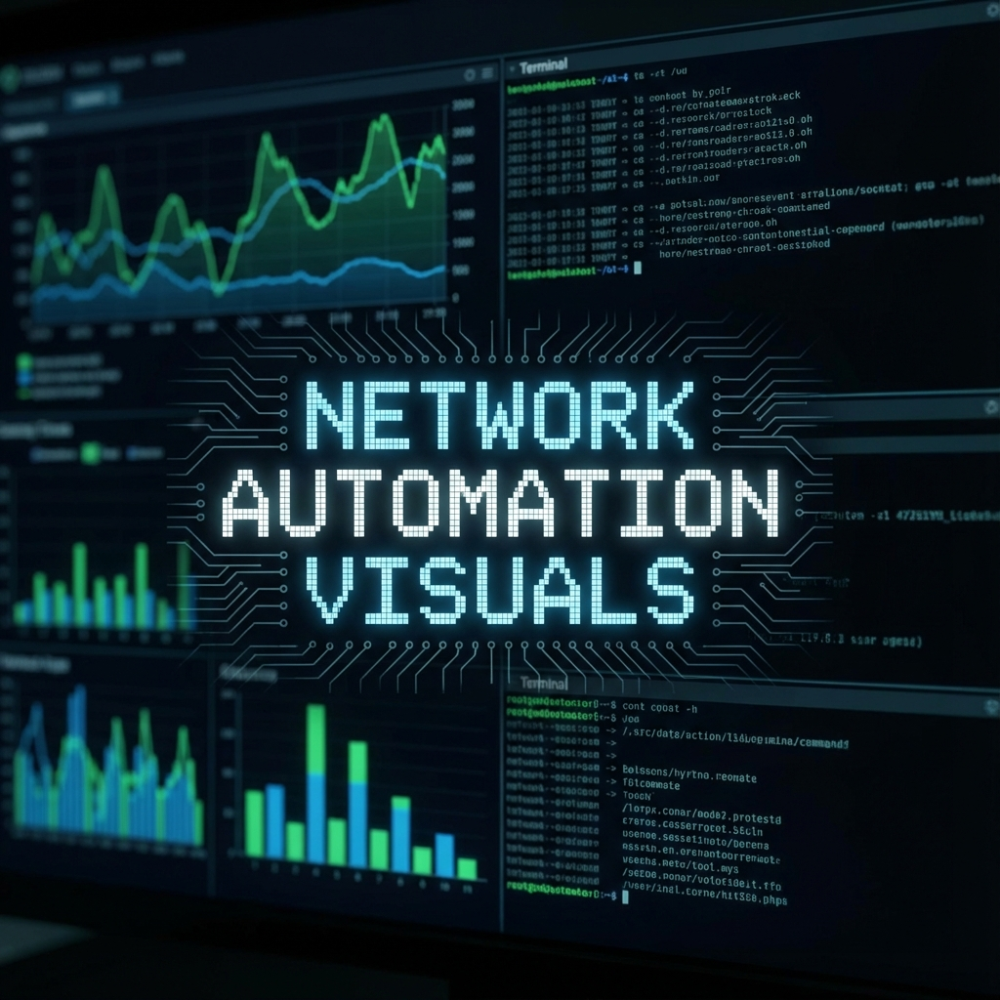
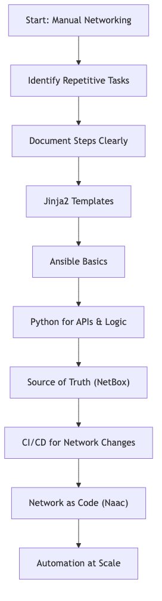
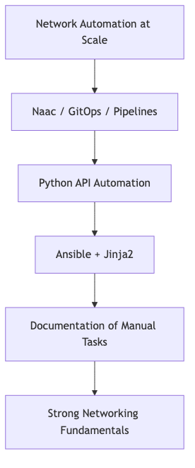
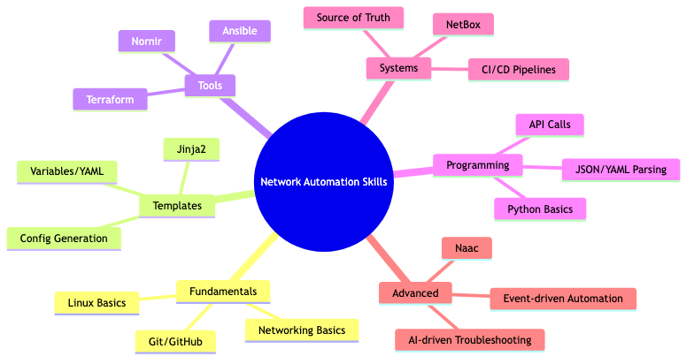
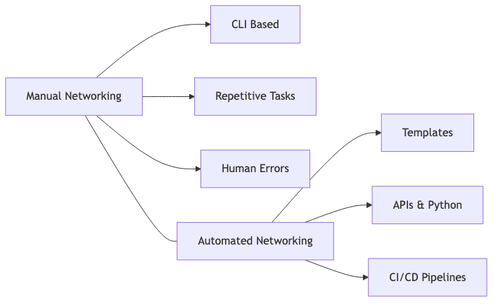
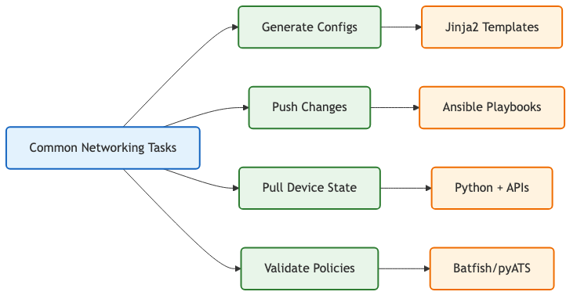
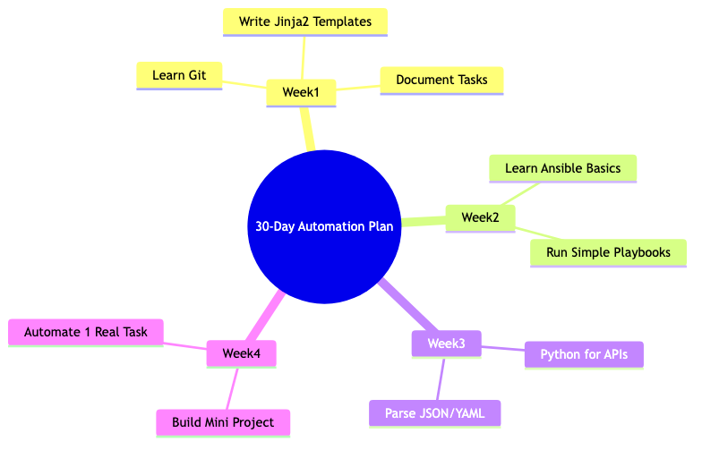
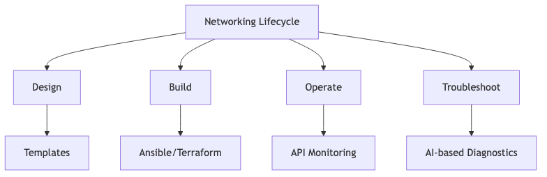

# Network Automation Visuals

This repository hosts content, diagrams, and ideas for my LinkedIn posts, focusing on **Network Automation**, **Architecture**, and **OT Security**.

## 📂 Repository Structure

- **`diagrams/`**: Contains Mermaid-based diagrams for easy versioning and editing.
- **`posts/`**: Drafts and final text for LinkedIn posts.
- **`assets/`**: Static images and resources.

## 🌟 Diagram Concepts

Here are the core diagram concepts included in this repo:

1.  **The Automation Starter Roadmap**
    
    [Source](diagrams/01-starter-roadmap.md)

2.  **The “Automation Pyramid”**
    
    [Source](diagrams/02-automation-pyramid.md)

3.  **Automation Skill Tree**
    
    [Source](diagrams/03-skill-tree.md)

4.  **The Automation Maturity Model**
    
    [Source](diagrams/04-maturity-model.md)

5.  **“Two Worlds” Diagram**
    
    [Source](diagrams/05-manual-vs-automated.md)

6.  **Task → Automation Mapping**
    
    [Source](diagrams/06-task-mapping.md)

7.  **Beginner Blueprint: 30-Day Plan**
    
    [Source](diagrams/07-30-day-plan.md)

8.  **Where Automation Fits**
    
    [Source](diagrams/08-automation-lifecycle.md)

9.  **Automation Path for OT Engineers**
    
    [Source](diagrams/09-ot-engineer-path.md)

10. **Automation Stack Diagram**
    
    [Source](diagrams/10-automation-stack.md)

---

*Generated for my LinkedIn content strategy.*
