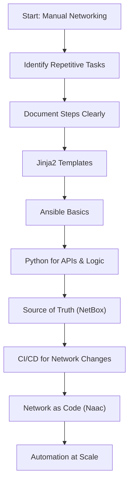

# 🧠 1. The Automation Starter Roadmap (Flowchart)

Shows the exact order a beginner should follow.

### **Diagram Focus:**

CLI → Templates → Ansible → Python → Pipelines → Naac

### **Mermaid:**

```mermaid
flowchart TD
    A[Start: Manual Networking] --> B[Identify Repetitive Tasks]
    B --> C[Document Steps Clearly]
    C --> D[Jinja2 Templates]
    D --> E[Ansible Basics]
    E --> F[Python for APIs & Logic]
    F --> G["Source of Truth (NetBox)"]
    G --> H[CI/CD for Network Changes]
    H --> I["Network as Code (Naac)"]
    I --> J[Automation at Scale]
```
