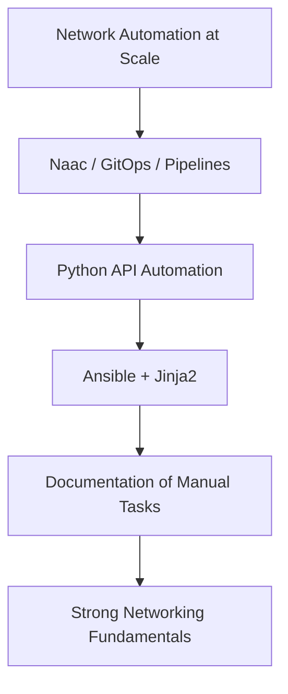

# 🧠 2. The “Automation Pyramid” (Hierarchy Diagram)

Shows how engineers progress from foundations → expert.

### **Mermaid:**

```mermaid
graph TD
   A[Network Automation at Scale] 
   A --> B[Naac / GitOps / Pipelines]
   B --> C[Python API Automation]
   C --> D[Ansible + Jinja2]
   D --> E[Documentation of Manual Tasks]
   E --> F[Strong Networking Fundamentals]
```
