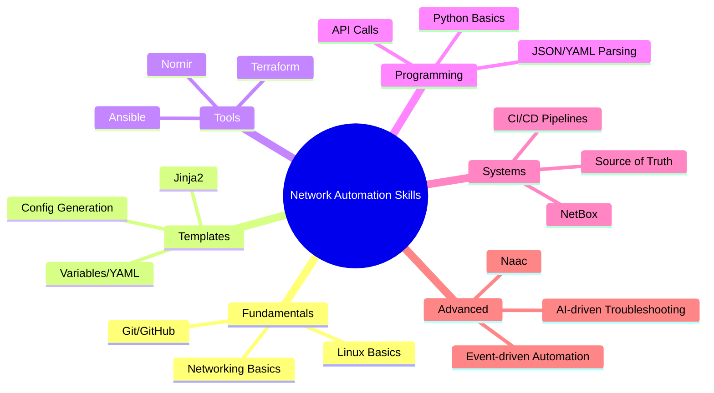

# 🧠 3. Automation Skill Tree Mindmap (Perfect for LinkedIn Carousels)

This is visually powerful and “savable.”

### **Mermaid:**

```mermaid
mindmap
  root((Network Automation Skills))
    Fundamentals
      Networking Basics
      Linux Basics
      Git/GitHub
    Templates
      Jinja2
      Variables/YAML
      Config Generation
    Tools
      Ansible
      Terraform
      Nornir
    Programming
      Python Basics
      API Calls
      JSON/YAML Parsing
    Systems
      NetBox
      Source of Truth
      CI/CD Pipelines
    Advanced
      Naac
      Event-driven Automation
      AI-driven Troubleshooting
```
