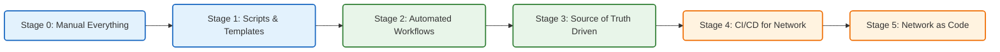

# 🧠 4. The Automation Maturity Model (Stages Diagram)

Good for managers + senior audiences.

### **Mermaid:**

```mermaid
graph LR
    A[Stage 0: Manual Everything] --> B[Stage 1: Scripts & Templates]
    B --> C[Stage 2: Automated Workflows]
    C --> D[Stage 3: Source of Truth Driven]
    D --> E[Stage 4: CI/CD for Network]
    E --> F[Stage 5: Network as Code]

    classDef default fill:#fff,stroke:#333,stroke-width:1px,rx:5,ry:5;
    classDef level1 fill:#e3f2fd,stroke:#1565c0,stroke-width:2px;
    classDef level2 fill:#e8f5e9,stroke:#2e7d32,stroke-width:2px;
    classDef level3 fill:#fff3e0,stroke:#ef6c00,stroke-width:2px;

    class A,B level1;
    class C,D level2;
    class E,F level3;
```
