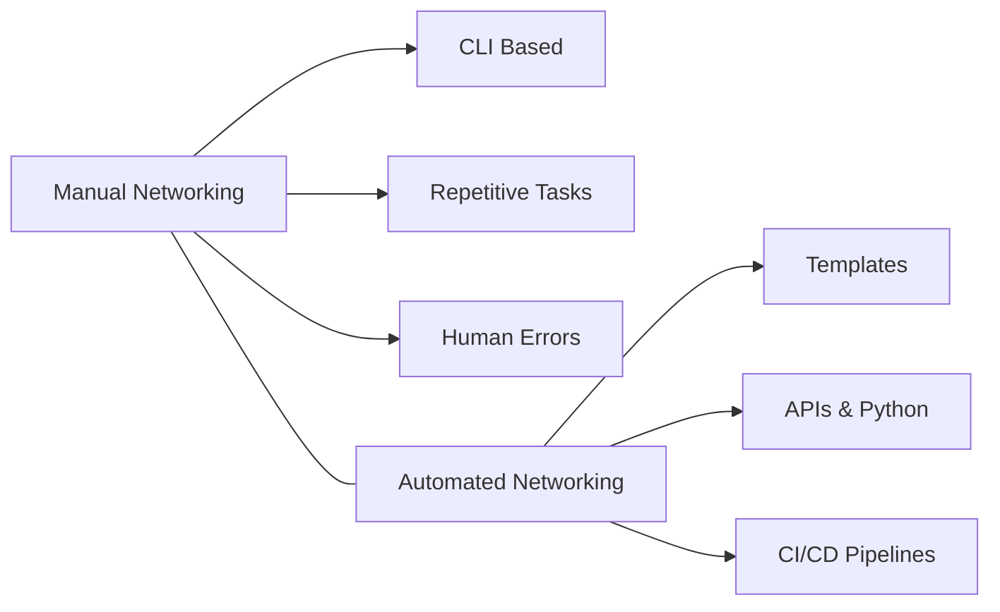

# 🧠 5. “Two Worlds” Diagram — Manual vs Automated

Perfect for before/after posts.

### **Mermaid:**

```mermaid
flowchart LR
    A[Manual Networking]
    A --> X1[CLI Based]
    A --> X2[Repetitive Tasks]
    A --> X3[Human Errors]

    B[Automated Networking]
    B --> Y1[Templates]
    B --> Y2[APIs & Python]
    B --> Y3[CI/CD Pipelines]

    A --- B
```
