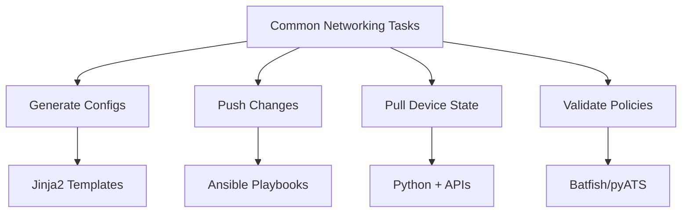

# 🧠 6. Task → Automation Mapping Diagram

Shows what tool fits what task.

### **Mermaid:**

```mermaid
flowchart TD
   A[Common Networking Tasks] --> B[Generate Configs]
   A --> C[Push Changes]
   A --> D[Pull Device State]
   A --> E[Validate Policies]

   B --> B2[Jinja2 Templates]
   C --> C2[Ansible Playbooks]
   D --> D2[Python + APIs]
   E --> E2[Batfish/pyATS]
```
