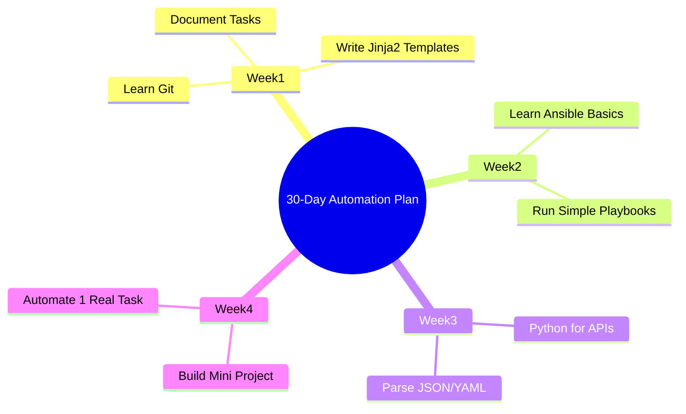

# 🧠 7. Beginner Blueprint: 30-Day Automation Plan

Super savable — great for career content.

### **Mermaid:**

```mermaid
mindmap
    root((30-Day Automation Plan))
        Week1
            Learn Git
            Document Tasks
            Write Jinja2 Templates
        Week2
            Learn Ansible Basics
            Run Simple Playbooks
        Week3
            Python for APIs
            Parse JSON/YAML
        Week4
            Build Mini Project
            Automate 1 Real Task
```
