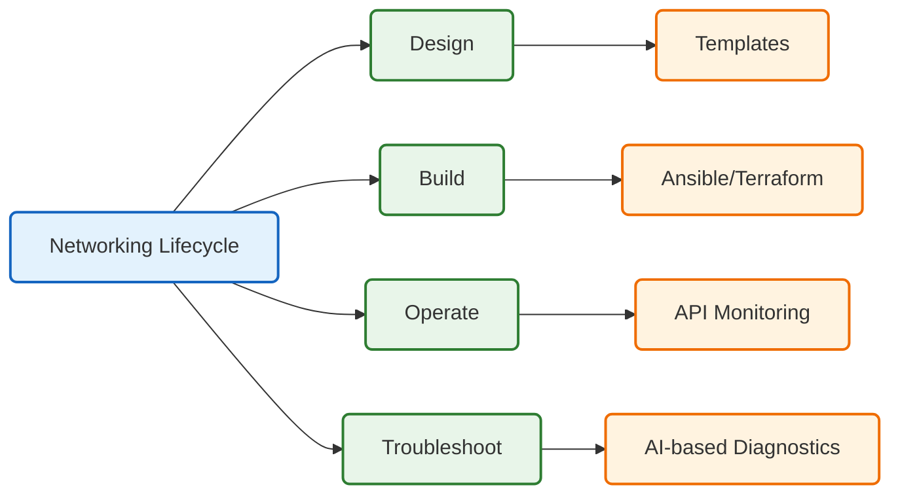

# 🧠 8. "Where Automation Fits in Networking" Diagram

Shows use cases clearly.

### **Mermaid:**

```mermaid
flowchart LR
    N[Networking Lifecycle]
    N --> D[Design]
    N --> B[Build]
    N --> O[Operate]
    N --> T[Troubleshoot]

    D --> D1[Templates]
    B --> B1[Ansible/Terraform]
    O --> O1[API Monitoring]
    T --> T1[AI-based Diagnostics]

    classDef default fill:#fff,stroke:#333,stroke-width:1px,rx:5,ry:5;
    classDef root fill:#e3f2fd,stroke:#1565c0,stroke-width:2px;
    classDef phase fill:#e8f5e9,stroke:#2e7d32,stroke-width:2px;
    classDef tool fill:#fff3e0,stroke:#ef6c00,stroke-width:2px;

    class N root;
    class D,B,O,T phase;
    class D1,B1,O1,T1 tool;
```
