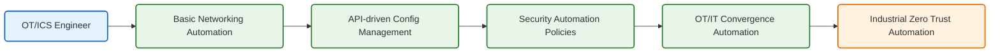

# 🧠 9. “Automation Path for OT Engineers” (OT-Aligned)

To connect your own niche.

### **Mermaid:**

```mermaid
flowchart LR
    A[OT/ICS Engineer] --> B[Basic Networking Automation]
    B --> C[API-driven Config Management]
    C --> D[Security Automation Policies]
    D --> E[OT/IT Convergence Automation]
    E --> F[Industrial Zero Trust Automation]

    classDef default fill:#fff,stroke:#333,stroke-width:1px,rx:5,ry:5;
    classDef start fill:#e3f2fd,stroke:#1565c0,stroke-width:2px;
    classDef step fill:#e8f5e9,stroke:#2e7d32,stroke-width:2px;
    classDef final fill:#fff3e0,stroke:#ef6c00,stroke-width:2px;

    class A start;
    class B,C,D,E step;
    class F final;
```
