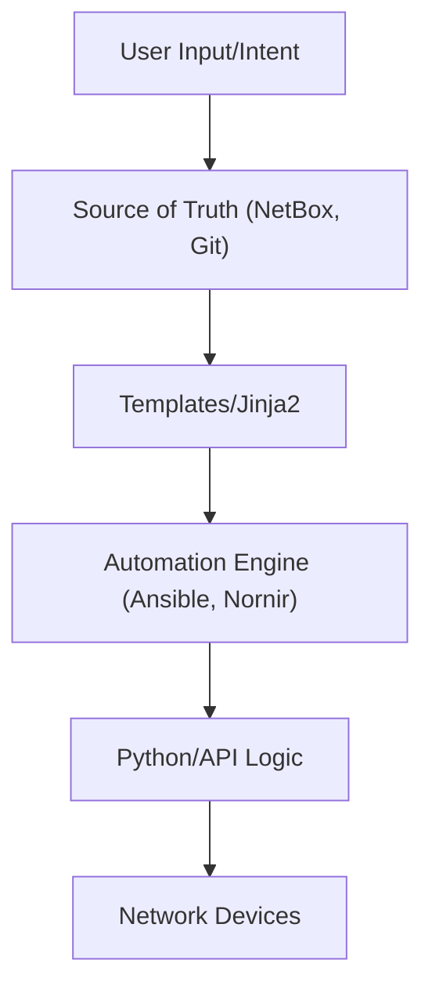

# 🧠 10. “Automation Stack Diagram” (Beautiful Layered View)

Perfect for explaining the architecture.

### **Mermaid:**

```mermaid
graph TD
    A[User Input/Intent]
    A --> B["Source of Truth (NetBox, Git)"]
    B --> C[Templates/Jinja2]
    C --> D["Automation Engine (Ansible, Nornir)"]
    D --> E[Python/API Logic]
    E --> F[Network Devices]
```
